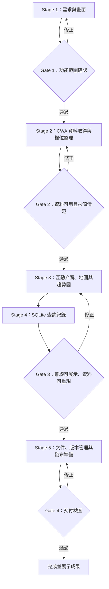

# HW1 開發流程與驗收關卡

目標：完成可在本機執行、可重現展示、能說明資料來源的台灣天氣預報應用程式。階段可依序驗收；前一關未通過時，先修正再進下一關。

## Stage 1：需求與畫面

- 盤點作業需求：台灣縣市預報、地圖、溫度趨勢、SQLite、可展示的 Streamlit 網頁。
- 確認使用情境與欄位名稱，先建立基本畫面與導覽。

**Gate 1：功能範圍確認**

- [x] 預報頁包含縣市選擇、天氣摘要、地圖、趨勢圖與詳細資料。
- [x] 介面標明資料來源和更新時間；示範資料明確標示為示範。

## Stage 2：CWA 資料取得與欄位整理

- 使用中央氣象署開放資料集 `F-C0032-001`。
- 授權碼從 `.env` 的 `CWA_API_KEY` 讀取，或由 Streamlit 側邊欄輸入；不得寫入程式碼、資料庫或提交到版本庫。
- 將 API 回應轉換為時間、天氣、溫度、降雨機率欄位，處理欄位缺漏、逾時和錯誤回應。

**Gate 2：資料可用且來源清楚**

- [ ] 有效授權碼的即時 CWA API 查詢（需本機設定金鑰後確認）。
- [x] 無金鑰或 API 失敗時顯示離線示範資料，並清楚告知使用者。
- [x] 不在畫面、日誌、SQLite 或 VCR cassette 中保存真實 API 金鑰；部署 Secrets 由伺服器端讀取。

## Stage 3：互動介面、地圖與趨勢圖

- 使用 Streamlit 呈現台灣縣市位置與選取縣市預報。
- 以圖表呈現預報時間與溫度；在明細表保留天氣及降雨機率。
- 手機與桌面瀏覽時，主要資訊仍可讀取。

## Stage 4：SQLite 查詢紀錄

- 首次啟動自動建立本機資料庫，只保存查詢時間、縣市和摘要。
- 資料庫不納入版本管理；重複重繪介面不應不斷新增同一筆查詢。

**Gate 3：離線可展示、資料可重現**

- [x] 無網路或 API 金鑰時仍能啟動和展示應用程式。
- [x] 資料來源狀態可辨認，不把示範值冒充即時預報。
- [x] SQLite 同時保存必要查詢摘要與預報欄位，不保存授權碼。
- [x] VCR cassette 可固定回放合成 CWA 回應；授權碼參數已遮蔽，pytest 離線回放通過。

## Stage 5：文件、版本管理與發布準備

- `README.md` 說明安裝、設定 `.env`、啟動方式及資料來源。
- `.gitignore` 排除 `.env`、虛擬環境、SQLite 資料庫及快取；只提交 `.env.example`。
- 在 GitHub 建立作業 Repository 後，推送程式與文件；不推送 `.env`、API 金鑰或本機資料庫。
- Streamlit 可部署到支援的平台；部署時用平台的 Secrets 管理金鑰，不要把 `.env` 上傳。

**Gate 4：交付檢查**

- [x] 新環境依 README 可安裝並啟動 Streamlit；pytest/VCR 開發依賴另列。
- [x] 離線示範路徑可展示，CWA 路徑及資料來源交代清楚。
- [ ] GitHub 尚未登入，尚不能檢視追蹤清單或推送；`.gitignore` 已排除 `.env`、資料庫和虛擬環境。
- [ ] 如需線上展示，確認部署平台的 Secrets 已設定後再發布。

## 本次實作對照

- Stage 1–4：已建立在 `app.py` 與 `cwa_client.py`，包含縣市預報、地圖、溫度圖表、離線示範、SQLite 查詢紀錄與預報明細。
- Stage 2 金鑰：支援 `.env`、環境變數與側邊欄輸入；範例檔為 `.env.example`。即時 API 驗證待使用者本機加入有效金鑰。
- Stage 3/4：VCR 回放已固定合成 CWA 回應並通過離線檢查。
- Stage 5：`README.md` 提供執行指引。GitHub CLI 現有登入憑證失效；公開 Repository `HW1-Taiwan-Weather` 待重新登入後建立並推送，線上部署其後再處理。
